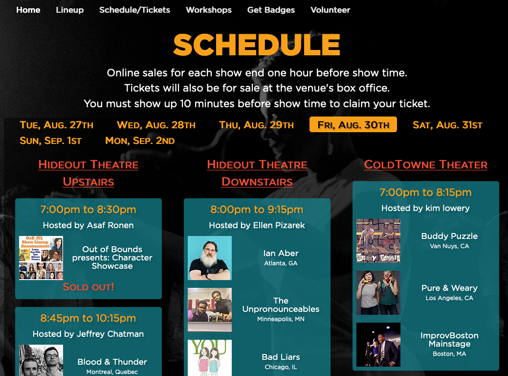

# OoBleck
Asset management software for the *Out of Bounds Comedy Festival*. 

Made with the VENoM stack (Vue, Express, Node and MongoDB) and released under the [GPLv3 License](https://www.gnu.org/licenses/gpl-3.0.en.html).

## Preview Images
### Public Calendar

### Volunteer Submission Form

### Adding and editing Workshops (Backend)

### Adding and editing schedule (Backend)

